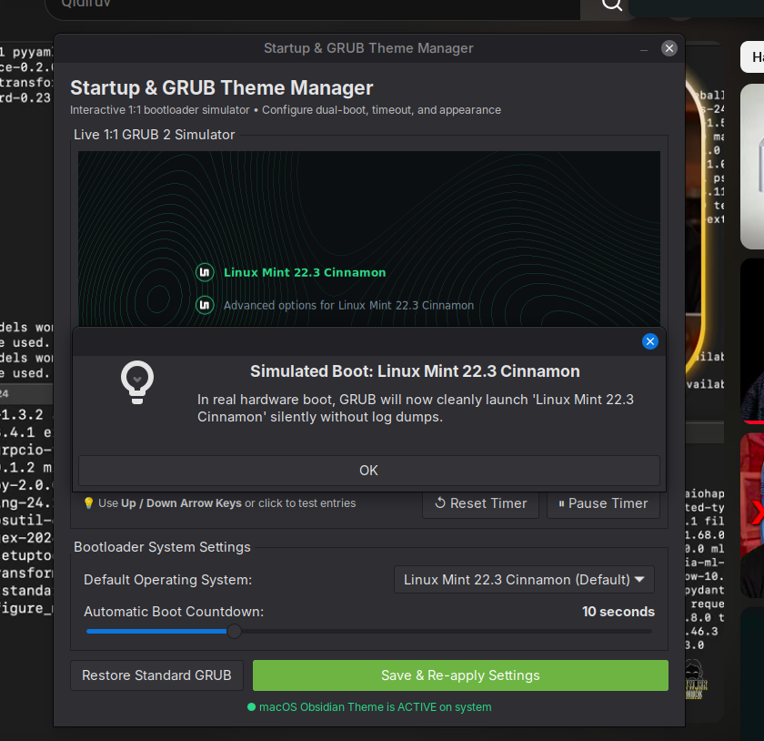
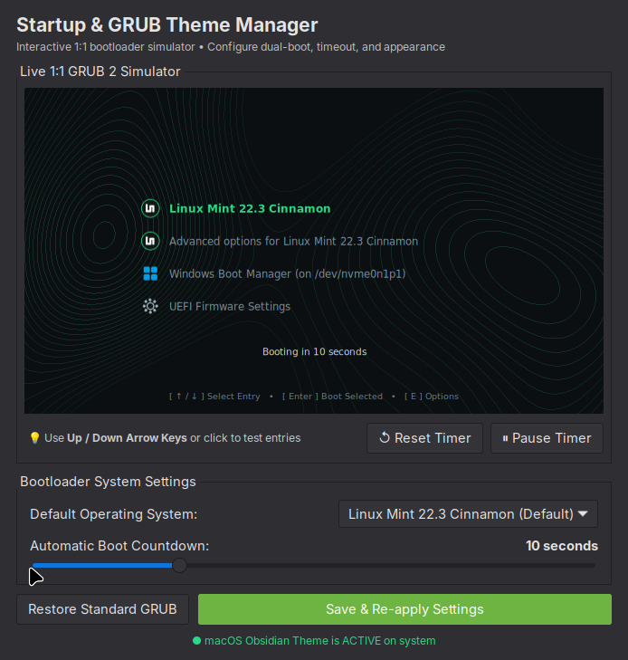

# Startup & GRUB Theme Manager 🚀

[](LICENSE)
[]()
[]()
[]()
[]()

A modern GTK3 application featuring a **1:1 live interactive bootloader simulator** alongside the minimalist, high-contrast **macOS Obsidian Dual-Boot theme** for GRUB 2.

Designed specifically for dual-boot setups (Linux Mint / Ubuntu / Fedora / Arch + Windows 11 / 10), fixing early boot ACPI BIOS error codes and providing an aesthetic, seamless boot experience.

---

## 📸 Screenshots

### 1. The Interactive GTK3 Manager Window


### 2. 1:1 Live Boot Screen Preview


---

## ✨ Features

* 🎮 **1:1 Live Interactive Simulator:**
  * Test and preview your exact bootloader screen inside a native Cairo canvas without restarting your PC!
  * **Dynamic OS Detection:** Automatically recognizes whether you are running Linux Mint, Ubuntu, Debian, Fedora, or Arch, alongside Windows and UEFI firmware.
  * **Full keyboard control:** Use `↑` and `↓` arrow keys to highlight entries, and `Enter` to select.
  * **Interactive mouse support:** Click any operating system row to select it.
  * **Live countdown timer:** Synchronized with your configured boot timeout, with pause and reset controls.
* 💎 **macOS Obsidian GRUB 2 Theme:**
  * **1920x1080 Native FHD:** High-resolution seamless emerald topographic isoline background.
  * **Floating Glowing Typography:** Minimalist glowing emerald highlight (`#2bd887`) on active entries.
  * **Zero Overlapping Boxes:** Eliminated ugly stretching glass frame artifacts.
  * **Official High-Res OS Icons:** Clean icons for Linux Mint, Windows 11, UEFI Firmware, Ubuntu, and generic Linux.
* 🤫 **Silent Boot Engineering & Safety:**
  * **Safe Kernel Parameter Merging:** Intelligently preserves existing custom kernel arguments (`nvidia-drm`, `resume=UUID`, power flags) while suppressing ACPI BIOS errors (`kernel.printk = 3 4 1 3`).
  * Enables clean, silent systemd boot parameters (`quiet splash loglevel=3 vt.global_cursor_default=0 systemd.show_status=0`).
  * Integrates Early KMS (`i915`) for Intel GPU systems for instant visual handover to your display driver.
* 🌐 **Universal Linux Compatibility:**
  * Out-of-the-box support for `update-grub`, `grub2-mkconfig`, and `grub-mkconfig`.
  * Supports both `/boot/grub` (Debian, Ubuntu, Mint, Arch) and `/boot/grub2` (Fedora, RHEL, openSUSE).
* ⚡ **Zero-Resource Background Policy:**
  * **0.00% Idle CPU, 0 MB Idle RAM.**
  * No background daemons or polling services. System updates are applied on-demand via standard PolicyKit (`pkexec`).
* 🔄 **One-Click Restore:**
  * Want to go back? Revert cleanly to the standard text-mode GRUB bootloader with one click.

---

## 🚀 Installation

### One-Line Quick Install
```bash
git clone https://github.com/bobuhasanov/grub-theme-manager.git
cd grub-theme-manager
chmod +x install.sh
./install.sh
```

> **Tip:** For automated, non-interactive installation, you can run:
> ```bash
> ./install.sh --yes
> ```

### What the installer does:
1. Automatically resolves dependencies across Debian/Ubuntu/Mint (`apt`), Fedora (`dnf`), and Arch (`pacman`).
2. Installs the theme assets to `~/.local/share/grub-themes/mac-obsidian/`.
3. Installs the `grub-theme-manager` binary to `~/.local/bin/`.
4. Creates a desktop shortcut in your **Application Menu** (under Administration / Preferences) with absolute path resolution.
5. Gives you the option to immediately apply the theme to `/boot/grub/` with root authorization.

---

## 🖥 How to Use

1. Launch **Startup & GRUB Theme Manager** from your application menu or run:
   ```bash
   grub-theme-manager
   ```
2. Interact with the **Live Simulator**:
   * Press `↑` / `↓` to move between operating systems.
   * Click entries directly with your mouse.
   * Use the **Automatic Boot Countdown** slider to adjust timeout (e.g. 5s, 10s, 15s).
3. Click **"Save & Apply Settings"** to write all changes to `/etc/default/grub` and rebuild GRUB.
4. Reboot and enjoy your clean, silent, high-aesthetic boot screen!

---

## 💻 Compatibility

* **Operating Systems:**
  * Linux Mint 21.x / 22.x (Cinnamon, MATE, XFCE)
  * Ubuntu 20.04 / 22.04 / 24.04 LTS
  * Debian 11 / 12
  * Fedora 38 / 39 / 40 / 41
  * Arch Linux, Manjaro, EndeavourOS
  * Pop!_OS, Zorin OS, Elementary OS
* **Hardware & Resolution:**
  * 1920x1080 (16:9 Native FHD)
  * Compatible with ASUS, Lenovo ThinkPad, Dell, HP, Acer, and custom desktop builds.
  * UEFI & Legacy BIOS supported.

---

## 🔄 Uninstallation

To remove the manager and restore your default system bootloader:
```bash
./uninstall.sh
```

---

## 📄 License

This project is licensed under the [MIT License](LICENSE) - Copyright (c) 2026 **bobuhasanov**.
Feel free to star ⭐ the repository and contribute!
